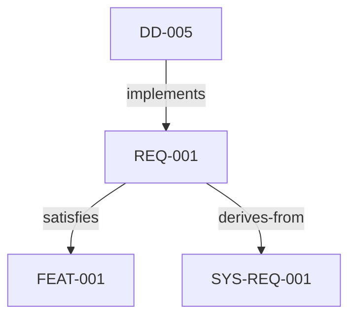

<!-- Generated by `rivet docs --export docs/reference` from the topics built into the rivet binary. Do not edit: `rivet docs check` fails when this file differs from them. -->

# documents — Documents — markdown with frontmatter, images, and diagrams

# Documents

Rivet treats markdown files as first-class project documents. Documents are
loaded from directories listed under `docs:` in `rivet.yaml`, parsed for
YAML frontmatter, and scanned for artifact references.

## Directory Layout

```yaml
# rivet.yaml
docs:
  - docs        # loads docs/*.md recursively
  - arch        # loads arch/*.md recursively
```

Each `.md` file becomes a document in the dashboard's Documents view.

## Frontmatter

Every document should start with a YAML frontmatter block:

```yaml
---
id: DOC-SRS
title: Software Requirements Specification
type: specification
status: approved
tags: [requirements, safety]
---
```

| Field  | Required | Description                              |
|--------|----------|------------------------------------------|
| id     | yes      | Unique document identifier               |
| title  | yes      | Display title                            |
| type   | no       | Document type (specification, plan, etc.) |
| status | no       | Lifecycle status (draft, approved, etc.)  |
| tags   | no       | Categorization tags                      |

## Artifact References

Use `[[ID]]` syntax to reference artifacts anywhere in the document body:

```markdown
The latency requirement [[REQ-001]] is satisfied by design decision [[DD-005]].
```

These are rendered as clickable links in the dashboard and tracked in the
document-artifact linkage view. Broken references (IDs not found in the
artifact store) are visually flagged.

## Images

Embed images using standard markdown syntax:

```markdown


```

Images are resolved relative to the document's `docs:` directory.
Place images in a subdirectory (e.g. `docs/images/`) and reference them
with a relative path.

Supported formats: PNG, JPEG, GIF, SVG, WebP.

In the dashboard, image paths are served via `/docs-asset/` — e.g.
`images/arch.png` in a doc becomes `/docs-asset/images/arch.png`.

## Mermaid Diagrams

Embed diagrams using fenced code blocks with the `mermaid` language tag:

````markdown

````

Mermaid diagrams are rendered client-side in the dashboard. Supported
diagram types include:

- **flowchart / graph** — dependency and flow diagrams
- **sequence** — interaction sequences
- **state** — state machines
- **class** — structure diagrams
- **gantt** — timeline views
- **C4** — architecture (C4 model)

### Tips

- Use artifact IDs as node names to match traceability
- Keep diagrams focused (10-20 nodes max) for readability
- The `mermaid` block is passed through as-is in CLI text output

## AADL Diagrams

If you have spar (AADL parser) integration, use `aadl` code blocks:

````markdown
```aadl
root: flight_controller
```
````

These are rendered as interactive architecture diagrams via the WASM runtime.

## Sections and TOC

Headings (`##`, `###`, etc.) are parsed into sections. Documents with more
than two sections automatically get a table of contents in the dashboard.
Section-level artifact reference counts are shown in the TOC.

## Computed Embeds

Use `{{name}}` syntax to embed computed project data inline in documents:

### Artifact embeds (legacy)

```markdown
{{artifact:REQ-001}}            — inline artifact card
{{artifact:REQ-001:full}}       — full card with description, tags, links
{{links:REQ-001}}               — incoming/outgoing link table
{{table:requirement:id,title}}  — filtered artifact table
```

### Stats embed

```markdown
{{stats}}                       — full stats table (types, status, validation)
{{stats:types}}                 — artifact counts by type only
{{stats:status}}                — counts by status only
{{stats:validation}}            — validation summary only
```

### Coverage embed

```markdown
{{coverage}}                    — all traceability rules with percentage bars
{{coverage:rule-name}}          — single rule with uncovered artifact IDs
```

### Diagnostics embed

```markdown
{{diagnostics}}                 — all validation issues
{{diagnostics:error}}           — errors only
{{diagnostics:warning}}         — warnings only
```

### Matrix embed

```markdown
{{matrix}}                      — one matrix per traceability rule
{{matrix:requirement:feature}}  — specific source→target matrix
```

### Error handling

Unknown or malformed embeds render as a visible error (`embed-error` class),
never an empty string. This ensures broken embeds are noticed during review.

### In HTML export

Computed embeds in exported HTML include a provenance footer with the git
commit hash and timestamp, so reviewers can trace when data was generated.

## Validation

Documents participate in validation:

- **Broken references**: `[[ID]]` pointing to nonexistent artifacts are warnings
- **Coverage**: The doc-linkage view shows which artifacts are referenced in docs
- **Orphan detection**: Artifacts never referenced in any document are flagged
