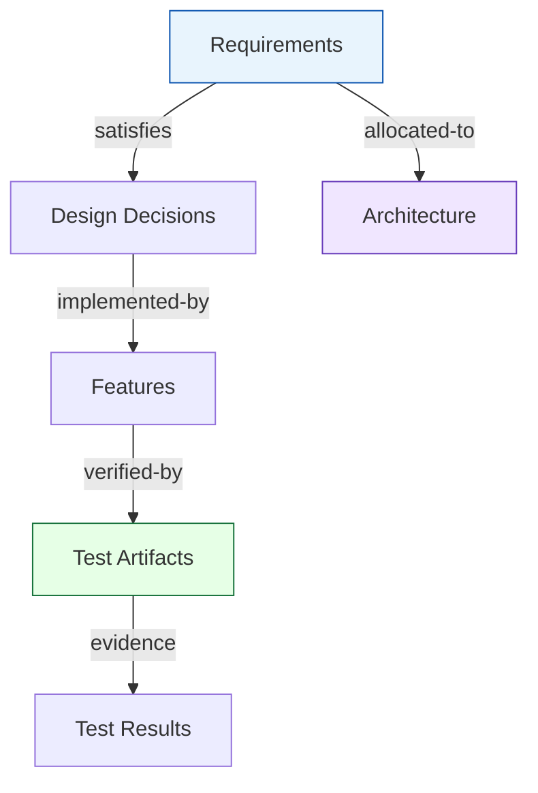

# System Requirements Specification

## 1. Purpose

This document specifies the system-level requirements for **Rivet**, an SDLC
traceability tool for safety-critical systems.  Rivet manages lifecycle
artifacts (requirements, designs, tests, STPA analyses) as version-controlled
YAML files and validates their traceability links against composable schemas.

## 2. Scope

Rivet targets Automotive SPICE, ISO 26262, and ISO/SAE 21434 workflows.  It
replaces heavyweight ALM tools with a text-file-first, git-friendly approach.

## 3. Functional Requirements

### 3.1 Artifact Management

[[REQ-001]] defines the core principle: artifacts live as human-readable YAML
files under version control.

[[REQ-002]] extends this to STPA artifacts — losses, hazards, unsafe control
actions, causal factors, and loss scenarios.

### 3.2 Traceability

[[REQ-003]] requires full Automotive SPICE V-model traceability, from
stakeholder requirements down to unit verification and back.

[[REQ-004]] mandates a validation engine that checks link integrity,
cardinality constraints, required fields, and traceability coverage.

### 3.3 Schema System

[[REQ-010]] requires schema-driven validation where artifact types, fields,
link types, and traceability rules are defined declaratively.

[[REQ-015]] aligns schemas with ASPICE 4.0 terminology (verification replaces
test).

[[REQ-016]] adds cybersecurity schema support for ISO/SAE 21434 and ASPICE
SEC.1-4.

### 3.4 Interoperability

[[REQ-005]] covers ReqIF 1.2 import/export for requirements interchange with
tools like DOORS, Polarion, and codebeamer.

[[REQ-006]] specifies OSLC-based bidirectional synchronization rather than
per-tool REST adapters.

[[REQ-008]] enables WASM component adapters for custom format plugins.

### 3.5 User Interface

[[REQ-007]] requires both a CLI and an HTTP serve pattern for the dashboard.

### 3.6 Quality

[[REQ-012]] mandates comprehensive CI quality gates (fmt, clippy, test, miri,
audit, deny, vet, coverage).

[[REQ-013]] requires performance benchmarks with regression detection.

[[REQ-014]] structures test artifacts to mirror the ASPICE SWE.4/5/6 levels.

[[REQ-009]] ties test results to GitHub releases as evidence artifacts.

[[REQ-011]] pins Rust edition 2024 with MSRV 1.85.

### 3.7 Traceability Flow

The following diagram shows the traceability chain from stakeholder needs
through to verification evidence:

### 3.8 Key Requirement Details

The following requirement is the cornerstone of the system:

{{artifact:REQ-001}}

And the design decision that shapes tool integration:

{{artifact:DD-001}}

## 4. Glossary

See the glossary panel below (defined in document frontmatter).
